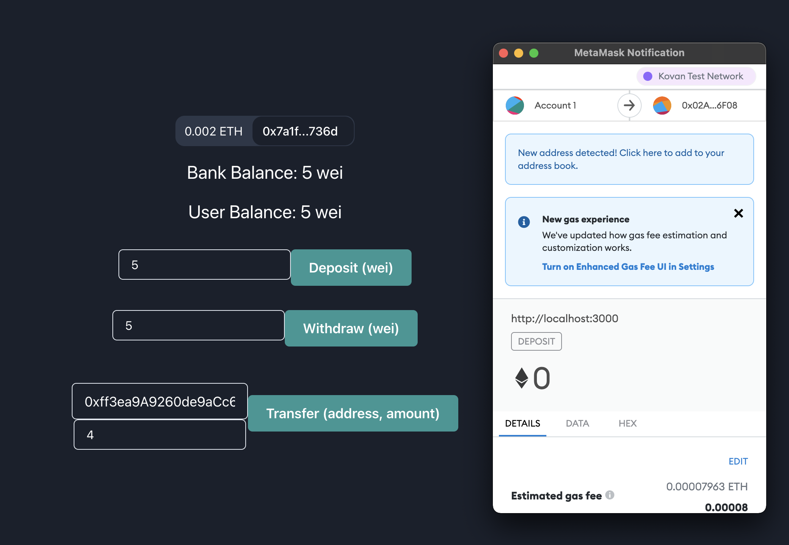

# simple-bank-blockchain

Contract Address: 0x02AD47eA03feaBF3C4621B2950e0853D939C6F08 [ETH Kovan Test Network](https://kovan.etherscan.io/tx/0x93a337f12b7f5ce4b8198cc829208c726d1a8c3269819911ef738b47c333db7b)

- User สามารถฝากเงิน
- User สามารถถอนเงิน
- User สามารถโอนเงินใน Bank ไปให้ User อื่นใน Bank
- User เช็ค Balance ในบัญชีของตัวเอง
- เช็คยอดเงินรวมของ Bank
